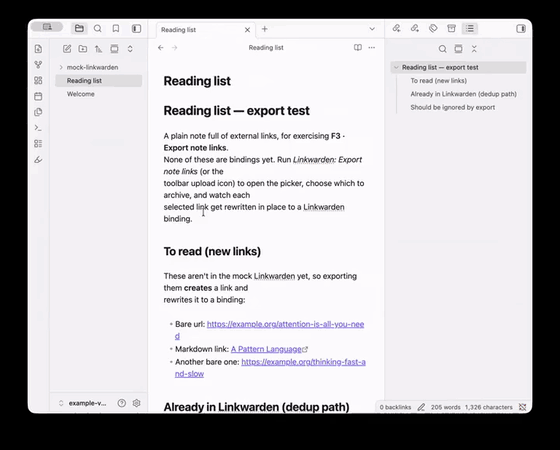

> The plugin is not officially from the Linkwarden project and has nothing to do with its development.

# Linkwarden for Obsidian

<p align="center">
  
</p>

**The [Linkwarden](https://linkwarden.app) plugin for Obsidian.** Search and link
your saved links, archive URLs to Linkwarden, and show their highlights as a
**living reading aid** next to the active note — without materializing them as
files. Guiding principle: **read in Linkwarden, write in Obsidian.**

No sync engine, no merge/clobber problem. A link is bound to Linkwarden by a
single Markdown link whose target is the instance deep URL (`<base>/links/<id>`);
the id in the href *is* the binding (single source of truth).

## Usage

Once the token and base URL are set (see [Setup](#setup)):

1. **Open the highlight panel.** Click the **highlighter** icon in the left
   ribbon (tooltip *"Linkwarden highlights"*), or run **Linkwarden: Open
   highlight panel** from the command palette. The panel docks on the right and
   tracks whichever note is active — that's where highlights show up, so keep an
   eye on it.
2. **Link a note to a Linkwarden entry.** With the cursor where you want the
   link, run **Linkwarden: Link a source (search)** (also the 🔍 button in the
   panel toolbar). Search your library and pick a result; a Markdown link bound
   to that entry's stable id is inserted. If you search a URL that isn't saved
   yet, the picker offers to archive it on the spot.
3. **Read its highlights.** The panel scans the active note for Linkwarden
   links and lists each source's highlights (text, comment, color) in reading
   order. Use the ↻ button to refresh; it works offline from a cache.
4. **Insert a highlight as a quote.** Each highlight has an **Insert as
   quote** button that drops it into the note at the cursor as a callout with a
   referenceable block id (`^lw-<id>`). Highlight colors map to callout types and
   tags (configurable in settings).
5. **Archive a note's URLs.** Run **Linkwarden: Export note links** (⬆ in
   the toolbar) to list the note's external URLs as a checklist; selected ones
   are archived to Linkwarden and rewritten in place to their binding links. You
   can also scan the whole vault from that modal.
6. **Re-link a moved source.** If a link's Linkwarden id changed, put the
   cursor on it and run **Linkwarden: Re-link source under cursor** (🔗 in the
   toolbar) to re-bind it without touching the visible text.

All commands appear in the palette prefixed with **Linkwarden:**. The interface
follows Obsidian's display language — **English** and **German** ship today, with
English as the fallback for any other language.

## Features

- **Link picker** — a command opens a search box over your Linkwarden
  library (`/api/v1/search`); picking a result inserts a Markdown link bound to
  that link's stable id. The visible link text stays as a readable fallback.
- **Highlight panel** — a right-sidebar view that scans the active note for
  Linkwarden links and shows their highlights (text, comment, color), grouped
  per source, sorted in reading order. Works offline from a TTL cache.
- **Export / archive** — a command lists the note's external URLs as a
  checkbox list; selected URLs are `POST`ed to Linkwarden and the body link is
  rewritten to the binding deep URL. Server-side de-duplication is respected
  (enable `preventDuplicateLinks` in Linkwarden).
- **Insert highlight as a quote** — each highlight in the panel has an
  "insert" action that materializes it at the cursor as a callout with a
  referenceable block id (`^lw-<id>`). A configurable color→callout/tag map turns
  your highlight colors into searchable vault semantics.
- **Re-link** — re-bind a source whose Linkwarden id changed.

## Setup

1. In Linkwarden, create an access token under **Settings → Access Tokens**.
2. In Obsidian, open **Settings → Linkwarden** and paste the token. The base URL
   defaults to **Linkwarden Cloud** (`https://cloud.linkwarden.app`) — change it
   if you self-host. The token is stored via Obsidian's **SecretStorage**
   (device-local, OS-backed) — it never enters the synced vault. Requires
   Obsidian **≥ 1.12.7**; on Linux an OS secret backend (kwallet/libsecret) must
   be available.
3. (Optional) Set a default target collection, the deep-link target
   (`/links` vs `/preserved`), the color map, and the cache TTL.

## Network use & privacy

This plugin communicates with exactly one remote service: **your Linkwarden
instance** (Linkwarden Cloud by default, or your self-hosted URL).

- No request is made until you enter an access token — without a token the plugin
  performs no network activity.
- Sent only to your Linkwarden instance: your access token (as a `Bearer`
  header), the search queries you type in the picker, the URLs you choose to
  archive, and the ids of links whose highlights the panel loads. All requests go
  through Obsidian's `requestUrl`.
- The plugin collects **no telemetry** and contacts **no other servers**. Using
  it requires an account on a Linkwarden instance.

## Development

```bash
npm install
npm run dev        # esbuild watch → main.js
npm run build      # typecheck + production bundle
npm test           # vitest (unit tests for all pure logic)
npm run gen:api    # regenerate src/api/schema.ts from openapi/linkwarden.yaml
```

### API types are generated

The typed API layer is generated from Linkwarden's official OpenAPI spec
(vendored at [`openapi/linkwarden.yaml`](openapi/linkwarden.yaml)) via
[`openapi-typescript`](https://github.com/openapi-ts/openapi-typescript) into
`src/api/schema.ts`. A unit test (`tests/openapi-drift.test.ts`) fetches the
upstream spec and fails if it has drifted from the vendored copy — the signal to
run `npm run gen:api` and re-vendor. The runtime client (`src/api/client.ts`) is
a thin, dependency-injected wrapper over Obsidian's `requestUrl` (which bypasses
CORS at the Electron level), so it stays unit-testable with a fake HTTP client.

## License

[MIT](LICENSE)
